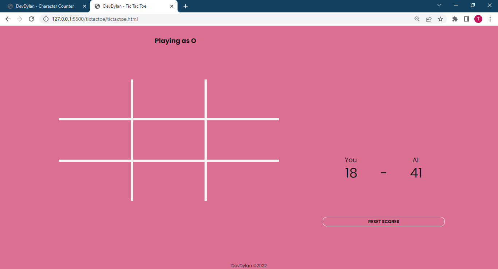

# Tic Tac Toe Game

## Description

Play tictactoe against a program with no decision-making capabilities.

View [Live Site](https://dev-dylann.github.io/tictactoe/)

## Features

- Keeps record of user's scores against the program
- Allows user to reset record of scores
- Vibrates user's device when an already occupied box is clicked (not all devices support this feature)
- Light/Dark theme based on user's OS theme

## Screenshot

## Built With

- Semantic HTML5 markup
- CSS3
- Vanilla JavaScript
- Mobile-first workflow
- Font from [Google Fonts](https://fonts.google.com)
